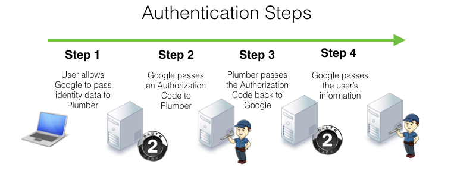

<center></center>


```{r, eval=FALSE}
library(jsonlite)
library(plumber)
library(httr)
library(openssl)

identify_user <- function(req, code=""){
  
  # Load OAuth2.0 credentials
  load("creds.rds")
  
  # Step 1 - User alllows Google to pass identity data to Plumber
  if(is.null(req$session$token) & code==""){
    url <-paste("https://accounts.google.com/o/oauth2/v2/auth?",
                "client_id=", google_credentials$client_id,"&",
                "response_type=code&",
                "scope=openid%20email&",
                "redirect_uri=", google_credentials$redirect_uri,"&",
                "state=token", sep="")
    httr::BROWSE(url)        
  }
  
  # Step 2 - Google passes an Authorization Code to Plumber
  if(is.null(req$session$token) & code!=""){
    url <- "https://www.googleapis.com/oauth2/v4/token"
    body <- list("code"=code,
                 "client_id"=google_credentials$client_id,
                 "client_secret"=google_credentials$client_secret,
                 "redirect_uri"=google_credentials$redirect_uri,
                 "grant_type"="authorization_code")
    # Step 3 -Plumber passes Authorization Code back to Google
    r <- POST(url, body = body, encode = "form")
    r_resp <- fromJSON(content(r, "text", encoding = "ISO-8859-1"))
    
    req$session$token <- r_resp$access_token
  }
  
  
  # Step 4 - Google passes the user information to Plumber
  if(!is.null(req$session$token)){
    r <- GET("https://www.googleapis.com/oauth2/v1/userinfo", query=list("alt"="json", "access_token"=req$session$token))
    new_resp <- content(r, "text", encoding = "ISO-8859-1")
    user <- fromJSON(new_resp)
    req$session$email <- user$email
    return(user)
}}
```


## Sample Code

### Plumber script

```{r, eval=FALSE}
#* @get /login
function(req, code=""){
  user <- identify_user(req, code)
  print(paste("Welcome ", user$email))
}

#* @get /second
function(req){
  if(is.null(req$session$email ))identify_user(req)
  print(req$session$email)
}
```

### Server script

```{r, eval=FALSE}
library(plumber)
library(plumber)
r <- plumb("sample_plumber.R") 
r$addGlobalProcessor(sessionCookie("secret", "token"))
r$addGlobalProcessor(sessionCookie("secret", "email"))
r$run(port=1410)
```

## Additional Scripts

### Cache Google OAuth Credentials

```{r, eval=FALSE}
cache_credentials <- function(client_id,client_secret,redirect_uri)
{
  google_credentials <- data.frame(client_id=client_id, client_secret=client_secret, redirect_uri=redirect_uri
                                   , stringsAsFactors = FALSE)
  save(google_credentials, file="creds.rds")
} 
```
 
**Usage**

```{r, eval=FALSE} 
cache_credentials(client_id = "###.apps.googleusercontent.com",
                  client_secret = "###",
                  redirect_uri = "http://localhost:1410/login")
```

### OAuth Link

```{r, eval=FALSE}
build_url <- function(){
  # Load OAuth2.0 credentials
  load("creds.rds")
  url <-paste("https://accounts.google.com/o/oauth2/v2/auth?",
                "client_id=", google_credentials$client_id,"&",
                "response_type=code&",
                "scope=openid%20email&",
                "redirect_uri=", google_credentials$redirect_uri,"&",
                "state=token", sep="")
   return(url)      
}

```
